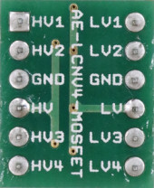
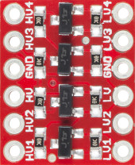
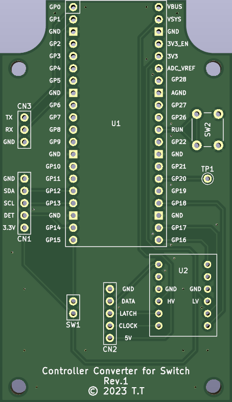
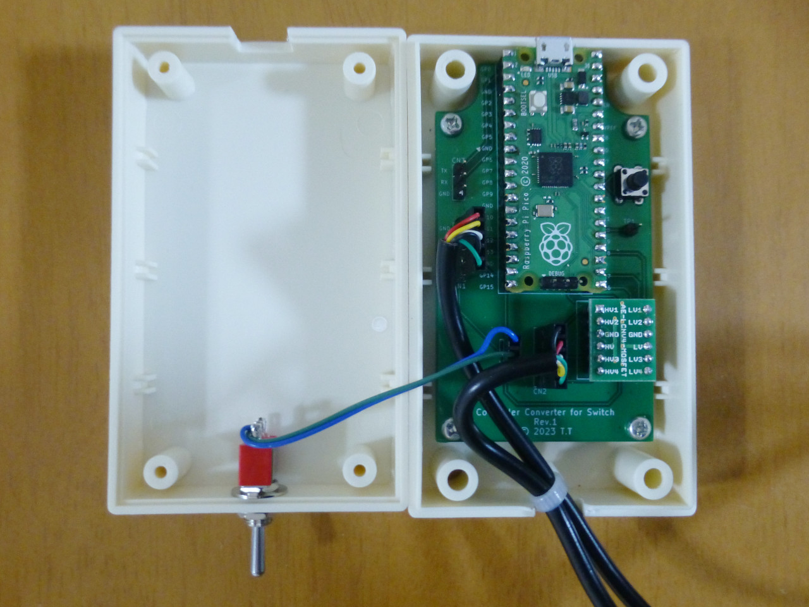

[English README is here](README.md)

# Controller Converter for Switch

Controller Converter for Switch は、以下のコントローラーをNintendo Switchで使用できるコンバーターです。

* スーパーファミコンに付属のコントローラー
* ニンテンドークラシックミニ スーパーファミコンに付属のコントローラー
* Wii用のクラシックコントローラー
* Wii用のクラシックコントローラーPRO

1ms周期で入力を読み取っているため、入力遅延が少ないです。

## 使い方

* 上記の何れかのコントローラーを接続してください。
* USBケーブルでNintendo Switchのドックに接続してください。
* トグルスイッチをONにするとL+RをZL+ZRに置き換えることができます。 
  スーパーファミコン用のコントローラーをNintendo Switch Onlineで使用する場合に便利です。
* スーパーファミコン用のコントローラーとWii用のコントローラーを同時に使用することが可能です。 
  但し、左右または上下の同時押しは無視されます。

## ハードウェアの作り方

### 基板の発注

#### JLCPCBで、オーダー番号を目立たない場所に印字したい場合

gerber_JLCPCB.zip をアップロードし、「Remove Order Number」から「Specify a location」を選択してください。

#### JLCPCBで、オーダー番号を印字したくない場合

gerber.zip をアップロードし、「Remove Order Number」から「Yes」を選択してください。 
但し、Yesを選択するとオプション料金がかかります。

#### JLCPCB以外の場合

gerber.zip をアップロードしてください。

### レベルコンバーターの選定

スーパーファミコン用コントローラーは5Vで動作しますが、Raspberry Pi Picoは3.3Vで動作します。 
そのため、スーパーファミコン用コントローラーを使用する場合は5Vと3.3Vの変換を行うレベルコンバーターが必要です。

* 秋月電子通商のAE-LCNV4-MOSFETは動作確認済です。 
  AE-LCNV4-MOSFETを使用する場合は、ピン名が書かれている面を上にして取り付けてください。
* SparkFunのBOB-12009もAE-LCNV4-MOSFETと全く同じ回路なので動作するはずです。 
  BOB-12009を使用する場合は、チップが搭載されている面を上にして取り付けてください。 
  (AE-LCNV4-MOSFETとはピン名の番号が逆順になります。)
* AmazonにはBOB-12009と同じピン配置のレベルコンバーターが幾つかありますが、搭載されているチップが不明なため、全く同じように動作する保証はありません。

### ケースの選定

基板は以下のケースを想定して設計されています。

* タカチ電機工業製 PR-105B
* タカチ電機工業製 PR-105G
* テイシン電機製 TB-32-B
* テイシン電機製 TB-32-IV

USBコネクタ、トグルスイッチ、コントローラーのケーブル用の穴をあけてください。

### 組み立て

* U1にソケットを半田付けし、Raspberry Pi Picoを取り付けてください。
* U2にソケットを半田付けし、レベルコンバーターを取り付けてください。
* SW1にトグルスイッチを接続してください。
* SW2にリセットスイッチを付けることができますが、無くても問題ありません。
* Wii用の延長ケーブルを半分に切り、メス側のケーブルをCN1に接続してください。
* スーパーファミコン用の延長ケーブルを半分に切り、メス側のケーブルをCN2に接続してください。
* CN3、TP1はファームウェアのデバッグ用なので、通常は何も接続する必要はありません。
* Raspberry Pi PicoのBOOTSELボタンを押しながらUSBケーブルを接続し、firmware.ino.sf2を書き込んでください。

## ファームウェアを改造する場合

* CN3にUSBシリアルコンバーターを接続し、firmware.ino の `#define DEBUG` を有効にすると、デバッグ出力が利用できます。 
  但し、デバッグ出力を利用する場合、1ms周期で入力を読み取ることはできなくなります。
* TP1にオシロスコープを接続すると、1ms以内に入力を読み取れているか確認できます。 
  (Wii用コントローラーの読み取り中はTP1がHighになります。)

### ファームウェアのビルド手順

1. Arduino IDEをインストール
2. firmware.inoを開く
3. 「File」→「Preferences...」をクリック
4. 「Additional boards manager URLs」欄に以下のURLをコピペし、「OK」をクリック 
   `https://github.com/earlephilhower/arduino-pico/releases/download/global/package_rp2040_index.json`
5. 「Tools」→「Board」→「Board Manager...」をクリック
6. 検索欄に「pico」と入力し、「Raspberry Pi Pico/RP2040 by Earle F. Philhower, III」をインストール
7. 「Tools」→「Board」→「Raspberry Pi Pico/RP2040」→「Raspberry Pi Pico」をクリック
8. 「Tools」→「Optimize」→「Fast (-Ofast) (maybe slower)」をクリック
9. 「Tools」→「USB Stack」→「No USB」をクリック
10. 「Sketch」→「Export Compiled Binary」をクリック
