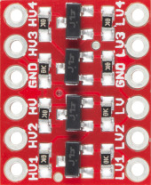

[日本語版 README はこちら](README-ja.md)

# Controller Converter for Switch

Controller Converter for Switch is a converter that allows the following controllers to be used with Nintendo Switch.

* Controller included with SNES
* Controller included with SNES Classic Edition
* Classic Controller for Wii
* Classic Controller PRO for Wii

Inputs are read in 1ms cycles, resulting in almost no input delay.

## How to Use

* Connect any of the above controllers.
* Connect to Nintendo Switch dock with a USB cable.
* You can replace L+R with ZL+ZR by turning on the toggle switch. 
  This is useful when using an SNES controller with Nintendo Switch Online.
* It is possible to use a SNES controller and a Wii controller at the same time. 
  However, pressing left and right or up and down at the same time will be ignored.

## How to Build Hardware

### Ordering PCBs

#### If you place an order with JLCPCB and want the order number printed in an inconspicuous location

Upload gerber_JLCPCB.zip and select "Specify a location" from the "Remove Order Number" options.

#### If you place an order with JLCPCB and do not want the order number printed

Upload gerber.zip and select "Yes" from the "Remove Order Number" options. 
However, if Yes is selected, an optional fee will be charged.

#### For orders outside of JLCPCB

Upload gerber.zip.

### Selection of Level Converter

SNES controller operates at 5V, but Raspberry Pi Pico operates at 3.3V. 
Therefore, when using SNES controller, a level converter is required to convert between 5V and 3.3V.

* AE-LCNV4-MOSFET manufactured by Akizuki Denshi Tsusho has been tested. 
  If you use AE-LCNV4-MOSFET, mount it with the side with the pin names facing up.
* BOB-12009 manufactured by SparkFun should also work because it is exactly the same circuit as AE-LCNV4-MOSFET. 
  If you use BOB-12009, mount it with the side with chips facing up. 
  (The numbers on the pin names are in reverse order from the AE-LCNV4-MOSFET.)
* There are several level converters on Amazon that have the same pin layout as BOB-12009,
  but there is no guarantee that they will work exactly the same way because the chips they contain are unknown.

### Selection of Case

The PCB is designed for the following cases.

* PR-105B manufactured by TAKACHI ELECTRONICS ENCLOSURE
* PR-105G manufactured by TAKACHI ELECTRONICS ENCLOSURE
* TB-32-B manufactured by Teishin Electric
* TB-32-IV manufactured by Teishin Electric

Make holes for USB connector, toggle switch, and controller cables.

### Assembly

* Solder sockets to U1 and mount a Raspberry Pi Pico.
* Solder sockets to U2 and mount a level converter.
* Connect a toggle switch to SW1.
* A reset switch can be attached to SW2, but there is no problem even without it.
* Cut the extension cable for Wii in half and connect the female cable to CN1.
* Cut the extension cable for SNES in half and connect the female cable to CN2.
* CN3 and TP1 are for debugging firmware, so normally nothing needs to be connected.
* While pressing the BOOTSEL button on the Raspberry Pi Pico, connect the USB cable and write the firmware.ino.sf2.

## If you modify firmware

* If you connect a USB serial converter to CN3 and enable `#define DEBUG` in firmware.ino, debug output is available. 
  However, when using the debug output, it will not be possible to read the input in 1 ms cycles.
* If you connect an oscilloscope to TP1, you can check whether input is read within 1ms. 
  (TP1 goes high while reading Wii controller.)

### How to Build Firmware

1. Install Arduino IDE
2. Open firmware.ino
3. Click "File", then "Preferences..."
4. Copy and paste the following URL into the "Additional boards manager URLs" field and click "OK" 
   `https://github.com/earlephilhower/arduino-pico/releases/download/global/package_rp2040_index.json`
5. Click "Tools", "Board", then "Board Manager..."
6. Type "pico" in the search field and install "Raspberry Pi Pico/RP2040 by Earle F. Philhower, III"
7. Click "Tools", "Board", "Raspberry Pi Pico/RP2040", then "Raspberry Pi Pico"
8. Click "Tools", "Optimize", then "Fast (-Ofast) (maybe slower)"
9. Click "Tools", "USB Stack", then "No USB"
10. Click "Sketch", then "Export Compiled Binary"
